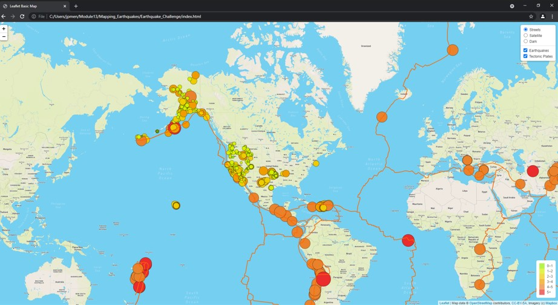

# Mapping_Earthquakes

## Overview of Project
### Basil and Sadhana like how you created your earthquake map with two different maps and the earthquake overlay. Now, Basil and Sadhana would like to see the earthquake data in relation to the tectonic plates’ location on the earth, and they would like to see all the earthquakes with a magnitude greater than 4.5 on the map, and they would like to see the data on a third map.
* Deliverable 1: Add Tectonic Plate Data
* Deliverable 2: Add Major Earthquake Data
* Deliverable 3: Add an Additional Map

## Basic Project Plan
### The purpose of this project is to visually show the differences between the magnitudes of earthquakes all over the world for the last seven days.  To complete this project, use a URL for GeoJSON earthquake data from the USGS website and retrieve geographical coordinates and the magnitudes of earthquakes for the last seven days.  The approach will be to use the JavaScript and the D3.js library to retrieve the coordinates and magnitudes of the earthquakes from the GeoJSON data.  Use the Leaflet library to plot the data on a Mapbox map through an API request and create interactivity for the earthquake data.

## Deliverable 1 output

## Deliverable 2 maps

## Deliverable 3 map

